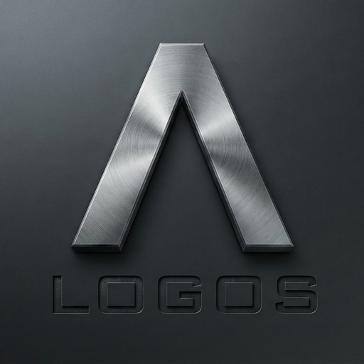

  

  
   
  <h1>The Engine for a Type-II Civilization</h1>
  
<strong>Computing at the Speed of Meaning. / 以意义的光速计算</strong>

  
  
  
   
  <h3>
    <a href="#en">English Manifesto</a> • <a href="#cn">中文宣言</a>
  </h3>

---

## 📜 The Negentropy Manifesto
### To Avoid Being Compute-Locked on Earth

> **"For 70 years, we taught computers to calculate. Now, let us teach them to understand."**

### 1. On the Shoulders of Giants

Before we take this step, we pay our highest tribute to **John von Neumann**, **Claude Shannon**, and **Alan Turing**.

70 years ago, when Von Neumann drew the classic architecture, he faced expensive vacuum tubes and scarce memory. He gave us the best possible solution for *that* era. The separation of storage and computation, the sequential decoding—these were not architectural errors, but historical compromises.

Today, we stand on their shoulders. We have the bandwidth Shannon dreamed of and the semantic data Turing envisioned. We are not here to overthrow their work, but to **fulfill their unfinished legacy**: to build a machine that follows the *Principle of Least Action*, processing "meaning" directly.

### 2. The Crisis: The Ant's View

Current computing operates from an "Ant's View."
The CPU is a blind worker ant. It moves bits (sand) without knowing if they belong to a masterpiece painting or a piece of garbage. Because it doesn't understand, it needs complex supervisors (decoders, branch predictors, out-of-order execution) to guide it.

This creates the **"Middleman Tax"**:
* To execute `if user == admin`:
* We compile strings to ASCII.
* We load bytes into registers.
* We compare byte by byte in a loop.
* **Result:** 90% of energy is wasted on "data logistics," not "business logic."

This is **High-Entropy Computing**. It generates heat, wastes electricity, and locks our AI capabilities within the limits of planetary energy production.

### 3. The Solution: The God's View

**Project LOGOS** flips the perspective to the "God's View" (Top-Down).

We start with the premise: **Python (and human logic) is a precise natural language.**
We map these high-level semantic concepts directly to unique, immutable **IDs (Atoms)**.

* **No Decoding:** The hardware sees `ID#Admin` and `ID#User`.
* **No Translation:** The instruction is simply `MATCH`.
* **Code is Silicon:** The software logic maps 1:1 to physical circuit paths.

### 4. Toward Type-II Civilization

If AI serves as the nervous system of our future civilization, it cannot run on inefficient, coal-burning architectures.
We need **Low-Entropy Computing**. We need a "Silent Mode" where machines communicate in pure logic (IDs), bypassing human visual redundancy until necessary.

Logos is the engine for this transition. It is the roadmap to a future where compute is as abundant as air, and as efficient as a neuron.

---

## 📜 计算熵减宣言 (The Negentropy Manifesto)
### 为了不被算力锁死在地球上 (To Avoid Being Compute-Locked on Earth)

> **“70年来，我们教会了计算机如何计算。现在，让我们教会它们如何理解。”**

### 1. 巨人的肩膀 (On the Shoulders of Giants)

在我们迈出这一步之前，让我们先向 **约翰·冯·诺依曼**、**克劳德·香农** 以及 **艾伦·图灵** 致以最崇高的敬意。

70 年前，当冯·诺依曼画下那张经典的架构图时，他面对的是昂贵的电子管和稀缺的内存。他给出了*那个*时代的最优解。存储与计算分离、串行解码——这些不是架构的错误，而是历史的妥协。

今天，我们站在了巨人的肩膀上。我们拥有了香农梦寐以求的无限带宽（极致信息密度），拥有了图灵构想的语义数据。并不是我们要推翻他们的丰碑，而是我们要**完成他们未竟的遗愿**：建造一台真正符合“最小作用量原理”、像大脑一样直接处理“意义”的机器。

### 2. 危机：蚂蚁视角 (The Crisis: The Ant's View)

当今的计算运作于“蚂蚁视角”。
CPU 是盲目的工蚁。它搬运比特（沙粒），却不知道它们属于一幅传世名画还是只是垃圾。因为它不理解，所以需要复杂的监工（解码器、分支预测、乱序执行）来指挥它。

这就产生了**“中间商税”**：
* 为了执行 `if user == admin`：
* 我们将字符串编译为 ASCII。
* 我们加载字节到寄存器。
* 我们循环逐字节比较。
* **结果**：90% 的能量浪费在“数据物流”上，而非“业务逻辑”。

这是**高熵计算**。它产生热量，浪费电力，将我们的 AI 能力锁死在行星能源的上限之内。

### 3. 解法：上帝视角 (The Solution: The God's View)

**Project LOGOS** 将视角反转为“上帝视角”（自顶向下）。

我们的前提是：**Python（及人类逻辑）是一种精确的自然语言。**
我们将这些高层语义概念直接映射为唯一、不可变的 **ID（原子）**。

* **无解码**：硬件直接看到 `ID#Admin` 和 `ID#User`。
* **无翻译**：指令仅仅是 `MATCH`。
* **代码即硅**：软件逻辑与物理电路路径 1:1 映射。

### 4. 迈向 Type-II 文明 (Toward Type-II Civilization)

如果 AI 是未来文明的神经系统，它就不能运行在低效的、烧煤的架构上。
我们需要**低熵计算**。我们需要一种“静默模式”，机器之间用纯逻辑（ID）交流，绕过人类视觉的冗余。

Logos 是这场转型的引擎。它是一张路线图，通往那个算力如空气般充沛、如神经元般高效的未来。

 

---

## 🗺️ The Architecture (Documentation / 文档)

The technical realization of this vision is detailed in our Request for Comments (RFCs / 技术提案):

### 🧱 [RFC-0001: Semantic Compute Architecture (SCA)](./rfcs/0001-sca-spec.md)
* **The Core Spec.** Defining the 64-bit and 8-bit "Semantic Atom."
* **SCP Hardware.** How the SCP-Z (Zero Payload) processor works.
* **The Unification.** How CPU logic and GPU math converge under one ID system.

### 🌍 [RFC-0002: The Global Rosetta Map](./rfcs/0002-rosetta-map.md)
* **The Protocol.** The global standard connecting human code to machine IDs.
* **The Map.** A decentralized, CC0-licensed dictionary for the digital universe.
* **Compute-View Separation.** Debugging via H-PU (Human Presentation Unit).

### 🚀 [RFC-0003: Velo - The Reference Implementation](./rfcs/0003-velo-reference.md)
* **The Product.** How [Velo Runtime](https://github.com/project-logos/velo) implements Logos concepts on legacy x86/ARM today.
* **Strategy.** The dual-track approach: Logos for the future standard, Velo for present-day performance.

---

## 🤝 Join the Foundation

We are building the **Global Rosetta Map**. This effort requires the collaboration of the world's brightest minds—compiler engineers, hardware architects, and philosophers.

* **License:** All specifications and the Map are released under **CC0 (Public Domain)**.
* **Action:** Start by reading [RFC-0001](./rfcs/0001-sca-spec.md).

**Join us. Let us teach silicon to speak Logos.**